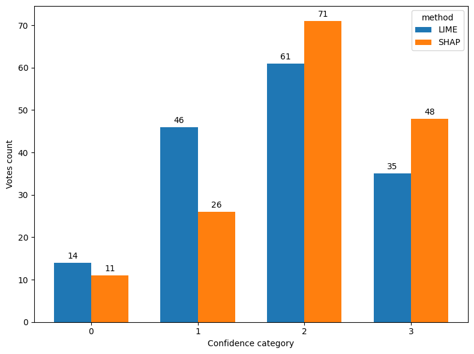

# [Tytuł mini-projektu]

**Autor:** Tymoteusz Zapała, nr indeksu: 266591

**Temat:**  5. Explainability — wyjaśnialność modelu (w domenie obiektów 3D)

**Kurs:** Aspekty prawne, społeczne i etyczne w AI, PWr 2025/2026

> Lista tematów: [Zasady zaliczenia — Menu mini-projektów](https://github.com/laugustyniak/ai-ethics-law-course/blob/main/Zasady%20zaliczenia.md#menu-mini-projekt%C3%B3w)

---

## Quick Start

```bash
uv sync                        # zainstaluj zależności
cp .env.example .env           # skopiuj wzór zmiennych środowiskowych
# uzupełnij klucze API w .env

uv run src/example_openai.py   # sprawdź że działa (OpenAI)
uv run src/example_anthropic.py  # lub Anthropic
uv run src/example_gemini.py     # lub Gemini
```

---

## Cel projektu

Celem projektu jest zbadanie możliwości wykorzystania metod wyjaśnialnej sztucznej inteligencji (XAI), takich jak SHAP oraz LIME, do analizy modeli przetwarzających dane w postaci obiektów 3D. Projekt ma na celu ocenę, które cechy geometryczne i strukturalne obiektów mają największy wpływ na decyzje modelu oraz zwiększenie transparentności procesu podejmowania decyzji przez system AI. Uzyskane wyniki mogą stanowić podstawę do wdrożenia tego typu narzędzi w rzeczywistych systemach, gdzie istotne są przejrzystość, zaufanie i możliwość weryfikacji działania modeli.

## Powiązanie z projektem grupowym
Projekt nie jest bezpośrednio powiązany z projektem grupowym, ponieważ ten koncentruje się na zagadnieniach z obszaru Chemia, dla których zastosowanie analizowanych metod wyjaśnialności byłoby trudniejsze do efektywnego wdrożenia. Wybrana tematyka obiektów 3D stanowi natomiast obszar moich indywidualnych zainteresowań rozwijanych od dłuższego czasu, dlatego projekt ten jest dla mnie okazją do pogłębienia wiedzy oraz praktycznego wykorzystania metod wyjaśnialnej sztucznej inteligencji w tej dziedzinie.

## Wymagania

Projekt korzysta z [uv](https://docs.astral.sh/uv/) — szybkiego menedżera pakietów Python.

```bash
# Instalacja uv (jeśli nie masz)
curl -LsSf https://astral.sh/uv/install.sh | sh

# Instalacja zależności
uv sync

# Z notebookami Jupyter
uv sync --extra notebooks
```

**Zmienne środowiskowe** — skopiuj plik `.env.example` i uzupełnij klucze API:

```bash
cp .env.example .env
# Uzupełnij klucze w .env (OpenAI / Anthropic / Google — w zależności od projektu)
```
## Uruchomienie

### 1. Opis projektu

Projekt służy do klasyfikacji obiektów 3D zapisanych jako chmury punktów (`.ply`) z wykorzystaniem modelu PointNet.
Po wykonaniu predykcji możliwe jest wygenerowanie wyjaśnień modelu przy użyciu metod LIME oraz SHAP, które wskazują najbardziej istotne fragmenty obiektu wpływające na decyzję klasyfikatora.

Rezultatem explainability są pliki `.ply` zawierające heatmapę istotności punktów — wizualizację najważniejszych regionów obiektu według obu metod.

Szczegółowy opis metod, analiza działania oraz porównanie wyników znajdują się w:

```text
notebooks/summary_report.ipynb
```

---

### 2. Dane

Do treningu oraz testów wykorzystano obiekty 3D ze zbioru:

* Hugging Face dataset: **ShapeSplats / ModelNet Splats**
* https://huggingface.co/datasets/ShapeSplats/ModelNet_Splats

Dataset zawiera obiekty 3D zapisane jako chmury punktów (`.ply`) pogrupowane w klasy.

---

### 3. Trenowanie modelu

Aby wytrenować model PointNet i wygenerować checkpoint wykorzystywany później do explainability:

```bash
uv run src/train.py \
  --model_name pointnet \
  --data_dir <ŚCIEŻKA_DO_DATASETU> \
  --log_dir lightning_logs \
  --run_name pointnet_experiment
```

Po zakończeniu treningu najlepszy checkpoint (`.ckpt`) zostanie zapisany w katalogu:

```text
lightning_logs/<run_name>/version_x/checkpoints/
```

Przykład:

```text
lightning_logs/pointnet_experiment/version_0/checkpoints/pointnet-epoch=25.ckpt
```

Ten checkpoint będzie wymagany do uruchomienia metod explainability.

---

### 4. Explainability — LIME

Uruchomienie explainability z wykorzystaniem LIME:

```bash
uv run src/scripts/run_point_lime.py \
  --input <ŚCIEŻKA_DO_PLIKU.ply> \
  --checkpoint <ŚCIEŻKA_DO_CHECKPOINTA.ckpt>
```

Przykład:

```bash
uv run src/scripts/run_point_lime.py \
  --input data/example/chair.ply \
  --checkpoint lightning_logs/pointnet_experiment/version_0/checkpoints/pointnet-epoch=25.ckpt
```

Wynik:

```text
visu/test_lime.ply
```

Plik zawiera heatmapę istotności punktów według metody LIME.

---

### 5. Explainability — SHAP

Uruchomienie explainability z wykorzystaniem SHAP:

```bash
uv run src/scripts/run_point_shap.py \
  --input <ŚCIEŻKA_DO_PLIKU.ply> \
  --checkpoint <ŚCIEŻKA_DO_CHECKPOINTA.ckpt> \
  --output_path <KATALOG_WYJŚCIOWY>
```

Przykład:

```bash
uv run src/scripts/run_point_shap.py \
  --input data/example/chair.ply \
  --checkpoint lightning_logs/pointnet_experiment/version_0/checkpoints/pointnet-epoch=25.ckpt \
  --output_path output/
```

Wynik:

```text
output/chair_shap.ply
```

Plik zawiera heatmapę istotności punktów według metody SHAP.


## Wyniki

### 1. Metryki klasyfikacji

Poniższa tabela przedstawia porównanie skuteczności klasyfikacji obiektów 3D ze zbioru ShapeSplats dla różnych architektur sieci neuronowych.
| Dataset    | Model      | Score |
|------------|------------|-------|
| Shapesplat | PointNet   | 0.869 |
| Shapesplat | PointNet++ | 0.875 |
| Shapesplat | PointNeXt  | 0.875 |
| Shapesplat | PointMLP   | 0.803 |

Dataset	Model	Score
Shapesplat	PointNet	0.869
Shapesplat	PointNet++	0.875
Shapesplat	PointNeXt	0.875
Shapesplat	PointMLP	0.803

Najwyższy wynik osiągnęły modele PointNet++ oraz PointNeXt, jednak jako model do analizy wyjaśnialności wybrano PointNet. Osiąga on porównywalnie wysoką skuteczność klasyfikacji, a jednocześnie charakteryzuje się prostszą architekturą, mniejszym rozmiarem oraz szybszym czasem inferencji. Dzięki temu stanowi dobry kompromis pomiędzy jakością predykcji a efektywnością obliczeniową, co czyni go praktycznym wyborem do analizy metod explainability takich jak LIME i SHAP.

### 2. PointSHAP i Point LIME
Poniżej znajduje się przykładowe porównanie działania metod explainability na obiekcie monitor, który został poprawnie sklasyfikowany przez model PointNet.

<video controls width="80%">
  <source src="wyniki/gifs/traj_monitor_017_comparison.mp4" type="video/mp4">
</video>

Na nagraniu przedstawiono kolejno:

obiekt oryginalny — wejściowa chmura punktów bez wizualizacji istotności,
obiekt wyjaśniony metodą LIME — punkty pokolorowane zgodnie z lokalnym wpływem na predykcję,
obiekt wyjaśniony metodą SHAP — punkty pokolorowane zgodnie z wartością wkładu Shapley’a.

Interpretacja obu metod jest analogiczna: im cieplejszy kolor (bardziej czerwony), tym większe znaczenie danego fragmentu obiektu dla decyzji modelu.

Na przykładzie obiektu monitor widać, że obie metody wskazują podobne obszary istotności (głównie centralne i charakterystyczne części obiektu), jednak różnią się zarówno sposobem rozkładania istotności, jak i dokładnym wyborem najbardziej wpływowych fragmentów. Pokazuje to, że mimo podobnego celu interpretacyjnego, LIME i SHAP mogą akcentować inne aspekty tej samej predykcji.

Szczegółowe porównanie oraz analiza jakościowa wyników znajdują się w `notebooks/summary_report.ipynb` wraz z większa liczbą przykładów.

<video controls width="80%">
  <source src="wyniki/gifs/traj_deer_moose_016_comparison.mp4" type="video/mp4">
</video>

### 3. Ankieta porównująca SHAP i LIME
Na podstawie wizualizacji explainability, podobnych do przedstawionych wcześniej przykładów, przeprowadzono krótkie badanie użytkowników mające na celu porównanie percepcji metod SHAP oraz LIME. Zadaniem respondentów było wskazanie, która metoda bardziej zwiększa ich pewność co do poprawności predykcji modelu oraz lepiej pomaga zrozumieć proces decyzyjny klasyfikatora.

Respondenci oceniali każdą metodę w skali od 0 do 3, gdzie:

0 — metoda nie pomaga w zrozumieniu działania modelu,
1 — metoda pomaga w niewielkim stopniu,
2 — metoda w zauważalny sposób wspiera interpretację predykcji,
3 — metoda w wysokim stopniu zwiększa zrozumienie i pewność co do decyzji modelu.

Poniżej przedstawiono rozkład odpowiedzi:

Z wyników ankiety wynika, że metoda SHAP częściej otrzymywała oceny 2 oraz 3, czyli te odpowiadające wyższemu poziomowi użyteczności interpretacyjnej. Różnica względem LIME nie jest duża, jednak wskazuje na lekką przewagę SHAP pod względem czytelności i intuicyjności prezentowanych wyjaśnień.

Może to wynikać z charakterystyki wizualizacji SHAP, gdzie heatmapa rozkłada istotność punktów w sposób bardziej ciągły i spójny przestrzennie, dzięki czemu łatwiej zauważyć główne obszary wpływające na decyzję modelu. W przypadku LIME wyjaśnienia bywają bardziej lokalne i fragmentaryczne, co czasem prowadzi do zaznaczania punktów oddalonych od głównych skupisk istotności, przez co interpretacja może być mniej intuicyjna.

Warto jednak zauważyć, że obie metody bardzo rzadko otrzymywały najniższe oceny (0 lub 1), co sugeruje, że zarówno SHAP, jak i LIME są użytecznymi narzędziami wspierającymi wyjaśnialność modeli klasyfikujących obiekty 3D.

## Wnioski merytoryczne
- Przeprowadzona analiza pokazuje, że metody explainability dla modeli klasyfikujących obiekty 3D pozwalają lepiej zrozumieć proces podejmowania decyzji przez model, jednak różne techniki interpretacyjne mogą prowadzić do odmiennych wniosków. Zarówno LIME, jak i SHAP wskazywały istotne fragmenty obiektów, ale różniły się rozkładem ważności oraz sposobem przypisywania wpływu poszczególnym punktom.

- Z perspektywy regulacyjnej ma to istotne znaczenie, szczególnie w kontekście rosnących wymagań dotyczących transparentności systemów AI, takich jak European Union AI Act. W systemach wysokiego ryzyka samo dostarczenie „wyjaśnienia” może być niewystarczające, jeśli różne metody prowadzą do różnych interpretacji tej samej decyzji. Oznacza to potrzebę stosowania wielu metod wyjaśnialności równolegle oraz dokumentowania ograniczeń każdej z nich.

- Z punktu widzenia etyki AI analiza potwierdza, że interpretowalność zwiększa możliwość audytu modeli i identyfikacji potencjalnych błędów lub niepożądanych wzorców decyzyjnych. Jest to szczególnie ważne w zastosowaniach takich jak robotyka, systemy autonomiczne czy analiza przestrzenna, gdzie błędna klasyfikacja obiektu może prowadzić do realnych konsekwencji operacyjnych.

- Dodatkowo analiza pokazuje, że metody PointSHAP i PointLIME, mimo że nie zostały pierwotnie zaprojektowane stricte z myślą o danych 3D, mogą zostać skutecznie zaadaptowane do pracy na chmurach punktów. Ich istotną zaletą jako metod post-hoc jest niezależność od architektury modelu — mogą być stosowane do różnych klasyfikatorów bez konieczności modyfikowania procesu treningowego czy samej struktury sieci. Jednocześnie ta elastyczność wiąże się z kosztem obliczeniowym: obie metody wymagają wielokrotnego wykonywania inferencji na zmodyfikowanych wariantach danych wejściowych, co w przypadku głębokich modeli może znacząco wydłużać czas generowania wyjaśnień.

- Wyniki przeprowadzonego, niewielkiego badania użytkowników (user study) sugerują również, że wyjaśnienia generowane przez metodę SHAP są odbierane jako nieco bardziej przekonujące i zwiększają poziom pewności użytkownika w ocenie poprawności decyzji modelu w większym stopniu niż wyjaśnienia generowane przez LIME. Może to wynikać z bardziej stabilnego i globalnie spójnego sposobu przypisywania istotności poszczególnym elementom wejścia.

## Ograniczenia

Projekt koncentruje się na analizie wyjaśnialności dla pojedynczej architektury modelu, co pozwala na dokładniejsze zbadanie zachowania metod explainability, ale ogranicza możliwość szerszego porównania. Jednym z głównych ograniczeń jest brak analizy porównawczej wyjaśnialności pomiędzy różnymi modelami klasyfikacji chmur punktów, takimi jak PointNet++, PointNeXt czy PointMLP. Tego typu porównanie mogłoby pokazać, czy różnice architektoniczne wpływają na stabilność, spójność lub jakość generowanych wyjaśnień.

Kolejnym ograniczeniem jest koszt obliczeniowy zastosowanych metod. Zarówno LIME, jak i SHAP wymagają wielokrotnych inferencji modelu na zmodyfikowanych danych wejściowych, co znacząco wydłuża czas analizy, szczególnie dla większych chmur punktów lub bardziej złożonych modeli.

Analiza została przeprowadzona na jednym zbiorze danych, co ogranicza możliwość generalizacji wniosków na inne domeny lub typy obiektów 3D. Testy na dodatkowych datasetach mogłyby zweryfikować, czy obserwowane wzorce wyjaśnialności pozostają spójne w innych warunkach.

Ograniczeniem jest również ograniczona skala badania użytkowników (user study). Uzyskane wyniki mają charakter wstępny i nie pozwalają na wyciąganie silnych statystycznie wniosków dotyczących percepcji jakości wyjaśnień przez użytkowników. Rozszerzenie badania na większą grupę respondentów pozwoliłoby lepiej ocenić praktyczną użyteczność wizualizacji explainability.

W przyszłości projekt można rozszerzyć o:

-porównanie explainability między wieloma architekturami modeli 3D,
-benchmarking czasu generowania wyjaśnień,
-zastosowanie natywnych metod interpretacji dedykowanych chmurom punktów,

## Źródła

- [PointSHAP](https://github.com/Mavisis/Shapley-based-Point-Additive-eXplenations) — Metoda SHAP aplikowana do obiektów 3D
- [PointLime](https://github.com/Explain3D/LIME-3D/tree/main) — Metoda LIME aplikowana do obiektów 3D
- [ShapeSplat Dataset](https://huggingface.co/datasets/ShapeSplats/ModelNet_Splats) — Metoda LIME aplikowana do obiektów 3D


